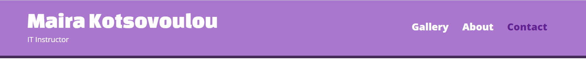
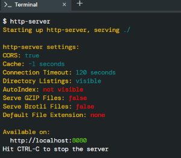

# Lab 1: Practice with CSS

## Tasks
In `intro.html`:
* Change the page title 
* Attach styles.css to the html
* Change the font of all elements in the page to a google font of your choice.

* For the header add:
    * Add a background color of your choice
    * A black solid bottom border of 5px

* For the hyperlinks on the nav:
    * Remove the bullets/markers from the list items.
    * Display them one next to the other
    * Add a padding of 8px
    * Add a margin of 5px

* For all other (plain) hyperlinks:
    * Remove the default underline style (unvisited and visited linkes), but add a underline when you mouse over a link (hover).





* For the `<h1>` elements:
    * Add a 20 pixels left and right margin to all <h1> elements.
    * Change the background color to Blue
    * Change the text color to off-White

* For the `<h2>` elements:
    * use the shorthand margin property to add these paddings -> left: 20px, right: 20px, top: 20px, bottom: 25px
    * use a font property to underline the text
    * make the text small-caps

* For the `help` class:
    * Set the width "200px"
    * Add a solid blue 2 pixels border
    * Add 25 pixels space between the element's border and it's content.




* For the `image grid` elements:
    * Edit responsive.css to make the grid display two columns for screen 940 and 1 column from screens less than 640


### HOW TO TEST
* Run the command `http-server` in your terminal, to start a web server that serves your webpage. 


* Control Click on: `http://localhost:8080` to view your work in another tab on your browser!
   



## SUBMIT YOUR WORK

Make sure that we have:

- [x] intro.html
- [x] styles.css
- [x] responsive.css
- [x] and you have TESTED your code :tada:

Execute the command below, logging in with your `GitHub username` and `Personal Access Token` when prompted. For security, you'll see asterisks (`*`) instead of the actual characters in your token. If you do not have generated a Personal Access ToKen follow the instructions: https://docs.github.com/en/authentication/keeping-your-account-and-data-secure/creating-a-personal-access-token

```
submit50 mkotsovoulou/itc4214sp22/main/labs/PracticeCss
```

@github/mkotsovoulou Do you have any questions?
