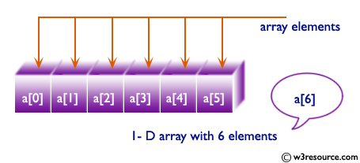

# Lab 2: JavaScript intro


## JavaScript Task 1
In `code.js`:
* there is an array declared.


* when the html page is displayed, the `result` div should display the contents of the numbers array



* Use a for loop:
`for (let i = 0; i < ____________ ; i++) {  }`

* or a foreach loop:
`numbers.forEach((num) =>{       });`




### HOW TO TEST
Run the command `http-server` in your terminal, to start a web server that serves your webpage. 




## HTML and JavaScript Task 2

* in `index.html` :
    * create a text field with id `num`
    * create a button to call a Javascipt function `add()`
* in `code.js` :
    * create a function `add()`
        * the function should read the value in the textfield `num`
        * convert it a number
        * add it in the array numbers
    * create a function `refresh()`
        * the function should refresh the contents of the `result` div with the updated numbers in the array



* Use `document.querySelector` to query for a single HTML element.
* Use `document.querySelectorAll` to query for multiple HTML elements that match a query. 
The function returns an array of all matching elements.






## CSS TASKS
* Edit styles.css to change the CSS of your webpage!
    * Modify the background color `result` div
    * Change the font of the `result` div





## Testing
* Run your http-server, if not already running

 

* Click on: `http://localhost:8080` to view your work in another tab on your browser!

* Make sure to test both incorrect and correct responses for each of your questions to ensure that your webpage responds appropriately.

## SUBMIT YOUR WORK

Make sure that we have:

- [x] index.html
- [x] styles.css
- [x] code.js
- [x] and you have TESTED your code :tada:

Execute the command below, logging in with your `GitHub username` and `Personal Access Token` when prompted. For security, you'll see asterisks (`*`) instead of the actual characters in your token. If you do not have generated a Personal Access ToKen follow the instructions: https://docs.github.com/en/authentication/keeping-your-account-and-data-secure/creating-a-personal-access-token

```
submit50 mkotsovoulou/itc4214sp22/main/labs/PracticeJS1
```

@github/mkotsovoulou Do you have any questions?