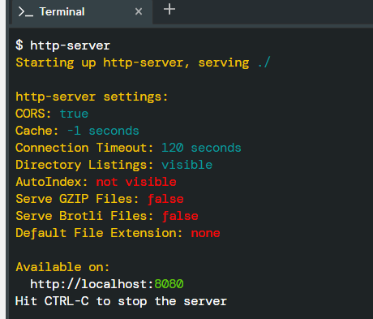

# Lab 2: WebPage Design and Javascript
Design a webpage using HTML, CSS, and JavaScript to let users answer trivia questions. Use the following screenshot to get ideas...


## HTML Tasks
In `trivia.html`:
* Add beneath “Part 1” a multiple-choice trivia question of your choosing with HTML.
* Use an `h3` heading for the text of your question.
* Create one `button` for each of the possible answer choices. There should be at least three answer choices, of which exactly one should be correct.
* Add beneath “Part 2” a text-based free response question of your choosing with HTML.
* Use an `h3` heading for the text of your question.
* Use an `input field` to let the user type a response.
* Use a `button` to let the user confirm their answer.


### HOW TO TEST
Run the command `http-server` in your terminal, to start a web server that serves your webpage. 




## JavaScript  Tasks
Include your javascript inside `trivia.html` in the `<script> </script>` tag.

* Add logic so that the buttons change colors when a user clicks on them.
    * If a user clicks on a button with an incorrect answer, the button should turn red and text should appear beneath the question that says “Incorrect”.
    * If a user clicks on a button with the correct answer, the button should turn green and text should appear beneath the question that says “Correct!”.
* add logic so that the text field changes color when a user confirms their answer.
    * If the user types an incorrect answer and presses the confirmation button, the text field should turn red and text should appear beneath the question that says “Incorrect”.
    * If the user types the correct answer and presses the confirmation button, the input field should turn green and text should appear beneath the question that says “Correct!”.



* Use `document.querySelector` to query for a single HTML element.
* Use `document.querySelectorAll` to query for multiple HTML elements that match a query. 
The function returns an array of all matching elements.





## CSS TASKS
* Edit styles.css to change the CSS of your webpage!
    * Modify the background color of your page
    * Include an image as background to the Trivia Hero Section
    * Modify the style and color of the h1 elements
    * Modify the style and color of all questions
    * Change the font for the questions to a google font of your choice, and the font color!
    * Change the font for the H1 elements to a different google font of your choice

## Optional
* Add additional trivia questions to your trivia quiz if you would like!




## Testing
* Run your http-server, if not already running

 

* Click on: `http://localhost:8080` to view your work in another tab on your browser!

* Make sure to test both incorrect and correct responses for each of your questions to ensure that your webpage responds appropriately.

## SUBMIT YOUR WORK

Make sure that we have:

- [x] trivial.html
- [x] styles.css
- [x] and you have TESTED your code :tada:

Execute the command below, logging in with your `GitHub username` and `Personal Access Token` when prompted. For security, you'll see asterisks (`*`) instead of the actual characters in your token. If you do not have generated a Personal Access ToKen follow the instructions: https://docs.github.com/en/authentication/keeping-your-account-and-data-secure/creating-a-personal-access-token

```
submit50 mkotsovoulou/itc4214sp22/main/labs/trivia
```

@github/mkotsovoulou Do you have any questions?